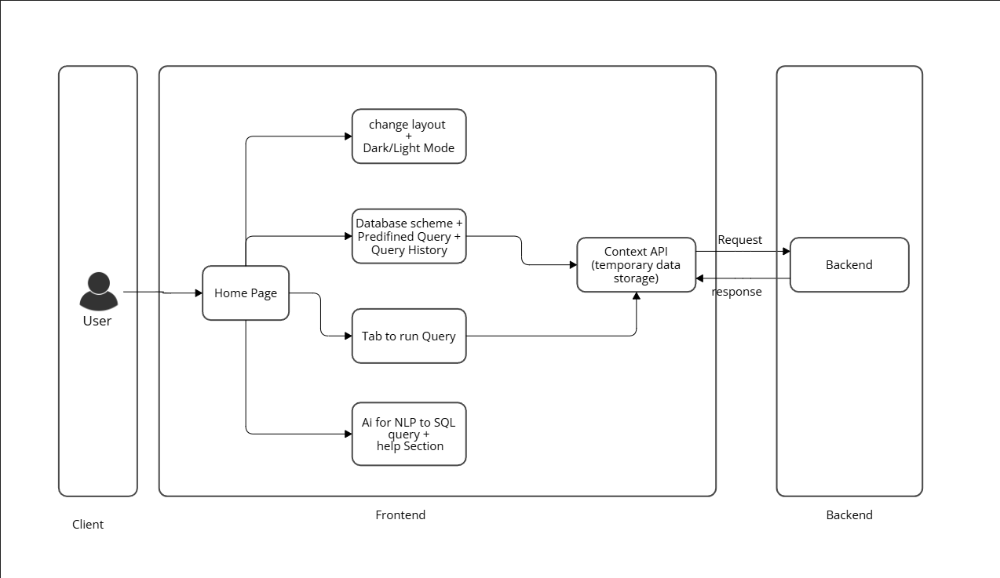
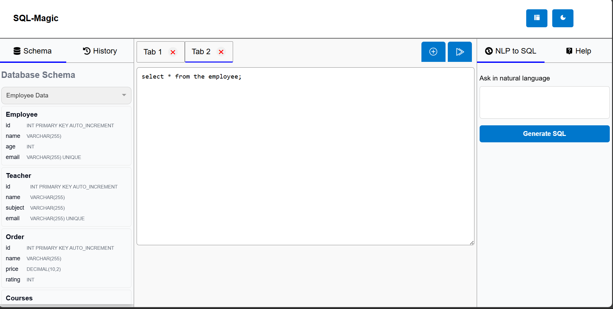
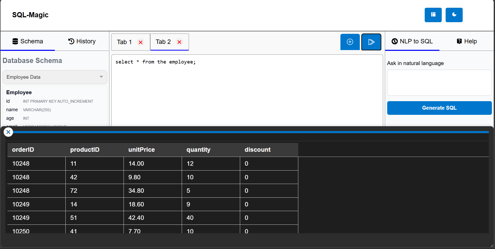
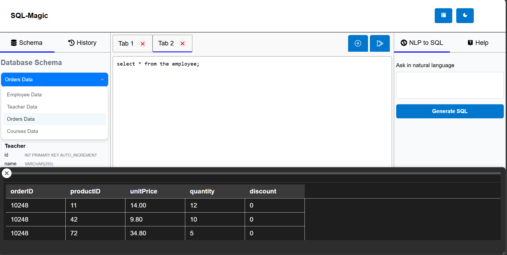
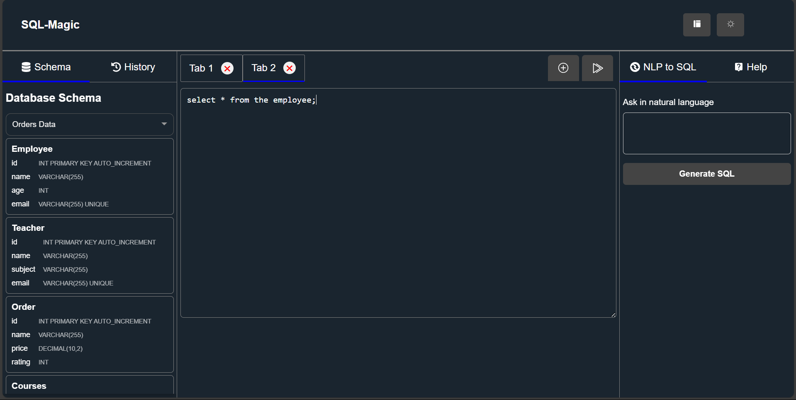
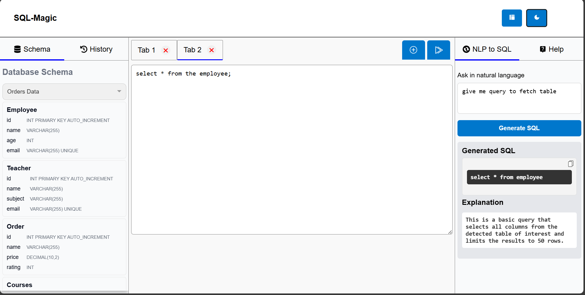
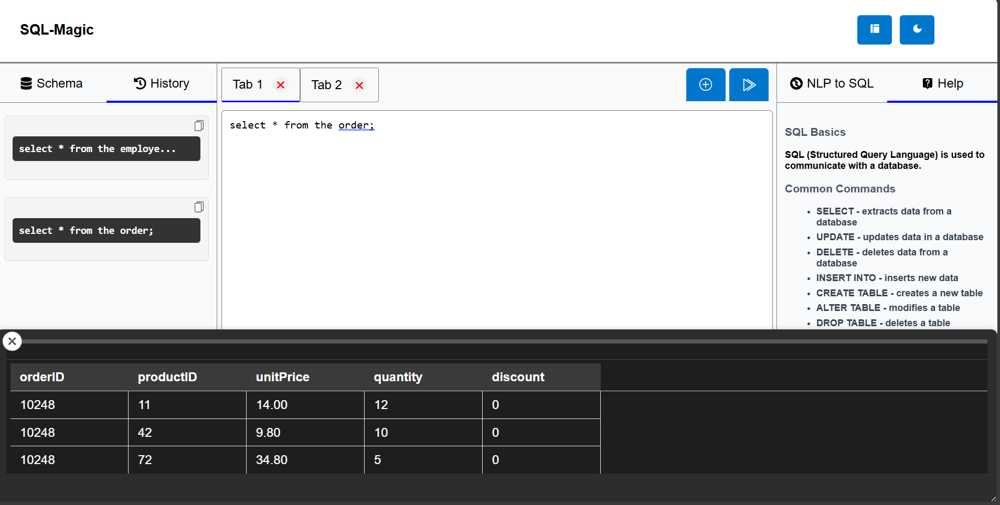

# 📊 SQL Query Visualizer Web App

A **React.js** web application that allows users to run SQL queries, view mock query results, and toggle between predefined queries and their corresponding data tables. It also supports viewing large SQL table data from CSV files.

---

## 🚀 **Features**

✅ Execute SQL queries and display results in a table format.  
✅ Toggle between predefined SQL queries and their corresponding table data.  
✅ View mock data from CSV files with lazy Loading.<br>
✅ Interactive dropdowns for table selection.<br>
✅ Smooth and stylish UI with CSS styling and dark mode compatibility.<br>
✅ Store history so that can be used any time if needed again.<br>
✅ AI feature to convert Natural language to sql Query any time you need.<br>
✅ Help Section<br>
✅ Multiple Tab to run multiple Query as and when needed.<br>
✅ Different Layout options as per the user requirement.<br>


---

## 🛠️ **Tech Stack**

- **Frontend:** React.js, HTML, CSS  
- **State Management:** Context API  
- **CSV Data Handling:** `papaparse` (for parsing CSV files)  
- **Dropdown Component:** `react-dropdown`  
- **Styling:** CSS Variables for light/dark mode support  

---


## **Measuring Page Load Time**  
### **Tools Used for Measurement:**  
We measured the page load time using:  
1. **Google Lighthouse (Chrome DevTools)**  
   - Open DevTools (`F12` in Chrome).  
   - Navigate to the **Lighthouse** tab.  
   - Run an audit to get metrics like **FCP, LCP, CLS, TBT, and INP**.  
2. **Network Tab in Chrome DevTools**  
   - Open DevTools → **Network** tab.  
   - Reload the page and check **DOMContentLoaded** and **Load Time**.  


### **Page Load Metrics:**  
- **Largest Contentful Paint (LCP):** ~0.36s  
- **Cumulative Layout Shift (CLS):** 0.09 
- **Load time:** ~646ms  

## **Optimizations for Performance Improvement**  
To enhance performance and reduce load time, we implemented the following optimizations:  

### **A. JavaScript & Code Optimization**   
✅ **Lazy loading components** (`React.lazy` + `Suspense`) for faster initial load.  
✅ **Removed unused JavaScript** with Tree Shaking.  

### **B. Image & Asset Optimization**  
✅ **Converted images to WebP** format for better compression.  
✅ **Used lazy loading for images** (`loading="lazy"` attribute).  


## ⚙️ **Installation Instructions**

### ✅ 1. Clone the Repository
```bash
git clone https://github.com/Suryanra/sqlmagic.git
cd sqlmagic
```

### ✅ 2. Install Dependencies
```bash
npm install
```

### ✅ 3. Start the Development Server
```bash
npm start
```

---

## 📚 **Folder Structure**
```plaintext
├── public                 
│   ├── data                # CSV files
│   │   ├── employee.csv
│   │   ├── products.csv
│   │   ├── orders.csv
│   │   └── courses.csv
|   |   └──customers.csv
│   ├── index.html
│   └── favicon.ico
│
├── src                    
│   ├── components   
│   │   └── style      
│   ├── context            
│   │   └── AppContext.js
│   │   └── AppPrvider.js
│   ├── App.js             
│   ├── index.js           
│
├── .gitignore             
├── package.json           
├── README.md              
└── yarn.lock / package-lock.json
```

---

## 🌟 **Usage Guide**

### 🎯 **1. Select a Table**
- Use the **dropdown** to choose between:
  - Employee Data
  - Teacher Data
  - Orders Data
  - Courses Data
- You can also View the table Schema
- History of all the Query you have run

### 🎯 **2. Run SQL Queries**
- Use the **query terminal** to enter SQL queries.
- Click **"Run"** to display mock data results.
- You can Open and close multiple tab as per your requirement.

### 🎯 **3. Toggle Dark Mode**
- Click the **dark mode toggle** button to switch between light and dark themes.


### 🎯 **3. Different layout**
- You can change the different layout as per the requirement.


### 🎯 **3. AI to generate the Query**
- Have AI chat bot that give support to convert the natural language to sql query.
- It also provide the explanation of the query generated


### 🎯 **3. Help Secction**
-Add the Help section for the users.


---
## 🖼️ **Performance Metrics**


---
## 🖼️ **Architecture Diagram**



---

## 🖼️ **Screenshots**

✅ *Home Page*  


✅ *Query Execution:*  


✅ *Table Selection with Dropdown* 


✅ *Dark Mode Enabled:*  


✅ *NLP to sql Query*  



✅ *SQL query history*  

---

## 🛀 **Dependencies**

```json
"dependencies": {
  "react": "^18.0.0",
  "react-dropdown": "^1.11.0",
  "papaparse": "^5.3.0",
  "react-scripts": "5.0.1"
}
```

---

### Thankyou 
